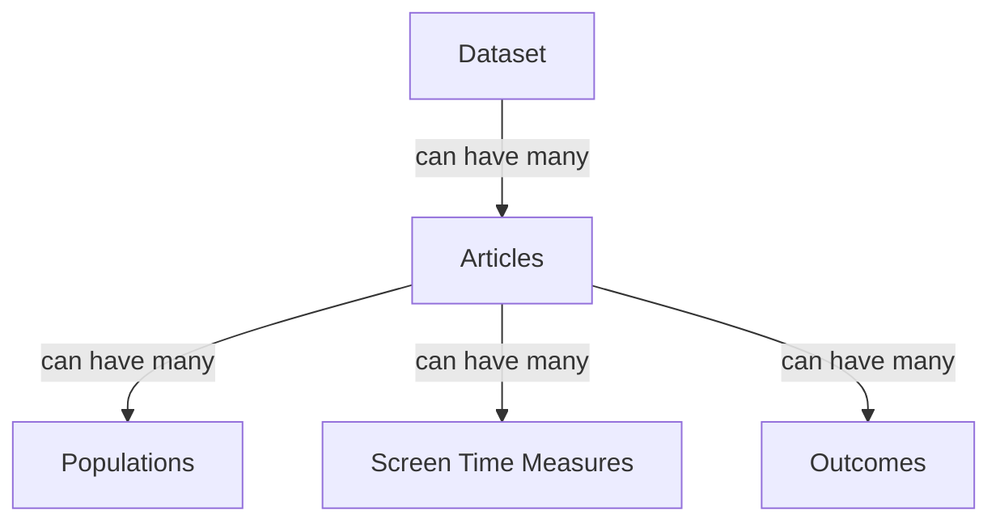

<!-- markdownlint-disable-file MD046 -->
# Extraction and Validation Overview

## Overview

Once we have identified articles with relevant datasets, we then need to extract the information about these datasets.
We won't have the capacity to get every dataset, so we need to be able to evaluate which datasets are likely to provide the most value.
The extraction process is automated, but we still need to check this data is accurate, and do things that like check if the dataset is a duplicate of an existing dataset.

In brief, the process of data extraction and validation is:

1. Articles are identified as ready for AI extraction during the [Full Text Screening](screening_process.md#full-text-screening) stage.
2. The AI extraction process is run on these articles to extract the relevant information.
   During this process:
      - The data is uploaded into the Airtable database.
      - The label in Rayyan is updated to indicate that the article has been extracted.
      - A new task is created in Asana to track the dataset.
3. A human reviewer checks the extracted data for accuracy, and checks if it is a duplicate of an existing dataset.
4. Once satisfied, the human reviewer marks the dataset as 'Validated' in Asana.
   This lets us know that the dataset is ready to be evaluated for the value it would add.

As the human reviewer, you come in from the third step onwards.
The below docs explain how to do these steps.

## Setup

To validate data, you will need access to the following tools:

- [Airtable](https://airtable.com/appYuP4DjRt023FK1)
- [Asana](https://app.asana.com/1/653672074038961/project/1210433819516828/list/1210434509883894)

## Data Structure

Before we describe the process, it is worth discussing the way that the data are structured in Airtable.

- Each **dataset** will have one or more **articles** associated with it.
  That is, a dataset might have been used for more than one study, and so it has been reported in more than one article.
- Each **article** can have one or more **populations**.
  Most studies will have one population, but some studies will report on different groups, like older or younger children, or boys and girls separately.
- Each **article** can have one or more **screen time measures**.
  For example, they might use a time use diary, and also a survey.
- Each **article** can have one or more **outcomes**.
  For example, they might report on behaviour problems, and also academic performance.
  Sometimes, they will also have multiple measures of the same outcome, like using multiple scales to measure wellbeing.
  

### Airtable Tables

Each of the above entities (datasets, articles, etc) has a table in Airtable.
Airtable then links these together, so we can see which articles are associated with which datasets, and so on.

Below is what is stored in each table, as reference.

=== "Datasets"

    | Column                                    | Description                                                                                                          | Example                                   |
    |-------------------------------------------|----------------------------------------------------------------------------------------------------------------------|-------------------------------------------|
    | **Dataset ID**                            | The ID of the dataset. Set by Asana automatically                                                                    | BPIPD-1                                   |
    | **Dataset Name**                          | The 'name' of the dataset, if it has one. Otherwise, the last name and year of the article the dataset was found in. | Longitudinal Study of Australian Children |
    | **Dataset Value**                         | The value [0,1] of the dataset. Set automatically.                                                                   | 0.03                                      |
    | **Total Sample Size**                     | The total number of participants in the dataset                                                                      | 1,000                                     |
    | **Dataset Contact Name**                  | The name of the person to contact for access to the data                                                             | John Doe                                  |
    | **Dataset Contact Email**                 | The email of the person to contact for access to the data                                                            |                                           |
    | **Countries of Data**                     | A list of the countries the data were collected in.                                                                  |                                           |
    | **Articles: IDs**                         |                                                                                                                      |                                           |
    | **Articles: Titles**                      |                                                                                                                      |                                           |
    | **Articles: Corresponding Authors**       |                                                                                                                      |                                           |
    | **Articles: Corresponding Author Emails** |                                                                                                                      |                                           |
    | **Status**                                |                                                                                                                      |                                           |

=== "Articles"

    Some text
