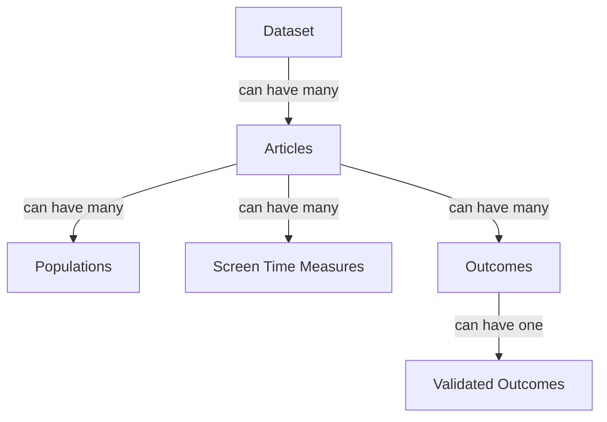

<!-- markdownlint-disable-file MD046 -->
# Extraction and Validation Overview

## Overview

Once we have identified articles with relevant datasets, we then need to extract the information about these datasets.
We won't have the capacity to get every dataset, so we need to be able to evaluate which datasets are likely to provide the most value.
The extraction process is automated, but we still need to check this data is accurate, and do things that like check if the dataset is a duplicate of an existing dataset.

In brief, the process of data extraction and validation is:

1. Articles are identified as ready for AI extraction during the [Full Text Screening](screening_process.md#full-text-screening) stage.
2. The AI extraction process is run on these articles to extract the relevant information.
   During this process:
      - The data is uploaded into the Airtable database.
      - The label in Rayyan is updated to indicate that the article has been extracted.
      - A new task is created in Asana to track the dataset.
3. A human reviewer checks the extracted data for accuracy, and checks if it is a duplicate of an existing dataset.
4. Once satisfied, the human reviewer marks the dataset as 'Validated' in Asana.
   This lets us know that the dataset is ready to be evaluated for the value it would add.

As the human reviewer, you come in from the third step onwards.
The below docs explain how to do these steps.

## Setup

To validate data, you will need access to the following tools:

- [Airtable](https://airtable.com/appYuP4DjRt023FK1)
- [Asana](https://app.asana.com/1/653672074038961/project/1210433819516828/list/1210434509883894)

## Data Structure

Before we describe the process, it is worth discussing the way that the data are structured in Airtable.

- Each **dataset** will have one or more **articles** associated with it.
  That is, a dataset might have been used for more than one study, and so it has been reported in more than one article.
- Each **article** can have one or more **populations**.
  Most studies will have one population, but some studies will report on different groups, like older or younger children, or boys and girls separately.
- Each **article** can have one or more **screen time measures**.
  For example, they might use a time use diary, and also a survey.
- Each **article** can have one or more **outcomes**.
  For example, they might report on behaviour problems, and also academic performance.
  Sometimes, they will also have multiple measures of the same outcome, like using multiple scales to measure wellbeing.
- Each **outcome** has one **validated outcome**.
  As the AI extraction is messy, we need a more consistent way to refer to the outcomes.
  For example, the AI might extract "anxiety symptoms" and "anxiety" as two separate outcomes.
  The validated outcome is the consistent way to refer to this, so we can say that both of these outcomes are measuring "Anxiety".
  This is important for the next step, where we will evaluate the value of each dataset.

### Airtable Tables

Each of the above entities (datasets, articles, etc) has a table in Airtable.
Airtable then links these together, so we can see which articles are associated with which datasets, and so on.

Below is what is stored in each table, as reference.

=== "Datasets"

    | Column                                    | Description                                                                                     | Example                                   | Editable[^*]                                          |
    |-------------------------------------------|-------------------------------------------------------------------------------------------------|-------------------------------------------|-------------------------------------------------------|
    | **Dataset ID**                            | The ID of the dataset. Set by Asana automatically                                               | BPIPD-1                                   | :material-close:{ title="Set automatically" }         |
    | **Dataset Name**                          | The 'name' of the dataset, or the author name and year of the article the dataset was found in. | Longitudinal Study of Australian Children | :material-check:                                      |
    | **Dataset Value**                         | The value of the dataset. Set automatically.                                                    | 11.1                                      | :material-close:{ title="Calculated automatically" }  |
    | **Total Sample Size**                     | The total number of participants in the dataset                                                 | 1,000                                     | :material-check:                                      |
    | **Dataset Contact Name**                  | The name of the person to contact for access to the data                                        | John Doe                                  | :material-check:                                      |
    | **Dataset Contact Email**                 | The email of the person to contact for access to the data                                       | john.doe@university.com                   | :material-check:                                      |
    | **Countries of Data**                     | A list of the countries the data were collected in.                                             | Australia, New Zealand                    | :material-check:                                      |
    | **Articles: IDs**                         | The IDs of the articles linked to this dataset (from Rayyan)                                    | 215786174                                 | :material-check:                                      |
    | **Articles: Titles**                      | The titles of the articles linked to this dataset                                               | Screens and teens                         | :material-close:{ title="Set by linking an article" } |
    | **Articles: Corresponding Authors**       | The corresponding authors of the articles linked to this dataset                                | John Doe                                  | :material-close:{ title="Set by linking an article" } |
    | **Articles: Corresponding Author Emails** | The corresponding authors' emails of the articles linked to this                                | john.doe@university.com                   | :material-close:{ title="Set by linking an article" } |
    | **Possible Duplicates**                   | Links to other datasets which are potentially duplicates that need to be [merged][dedupe]       | BPIPD-2                                   | :material-check:                                      |

=== "Articles"

    | Column                         | Description                                                                        | Example                      | Editable[^*]                                                                  |
    |--------------------------------|------------------------------------------------------------------------------------|------------------------------|-------------------------------------------------------------------------------|
    | **Rayyan ID**                  | The ID of the article in Rayyan                                                    | 215786174                    | :material-close:{ title="Set automatically" }                                 |
    | **Article Title**              | Title of the article                                                               | Screens and teens            | :material-check:                                                              |
    | **Authors**                    | The names of the authors                                                           | Doe, J.                      | :material-check:                                                              |
    | **Journal**                    | The journal the article is published in                                            | Science                      | :material-check:                                                              |
    | **DOI**                        | The DOI of the article                                                             | 10.1016/j.chb.2010.10.019    | :material-check:                                                              |
    | **Year**                       | Year the article was published                                                     | 2025                         | :material-check:                                                              |
    | **Fulltext**                   | An attachment with the full-text of the article                                    |                              | :material-check:                                                              |
    | **Corresponding Author**       | The corresponding author of the article                                            | John Doe                     | :material-check:                                                              |
    | **Corresponding Author Email** | The corresponding authors' emails                                                  | john.doe@university.com      | :material-check:                                                              |
    | **Year of Last Data Point**    | Year that the data were collected (or last year for longitudinal studies)          | 2023                         | :material-check:                                                              |
    | **Study Design**               | One of [`Cross-section`, `Longitudinal`, `Experimental`, or `Other`]               | Cross-sectional              | :material-check:                                                              |
    | **Countries of Data**          | A list of the countries the data were collected in.                                | Australia, New Zealand       | :material-check:                                                              |
    | **Total Sample Size**          | The total number of participants in the study                                      | 1,000                        | :material-check:                                                              |
    | **Screen Time Measure Name**   | A list of measures or instruments                                                  | "ScreenQ", "Custom Survey"   | :material-close:{ title="Set when linking screen time measures to articles" } |
    | **Outcome Groups**             | The broad groups of outcomes in the study                                          | "Mental Health", "Wellbeing" | :material-close:{ title="Set when linking outcomes to articles" }             |
    | **Outcomes**                   | The specific outcomes that were measured                                           | Anxiety, Depression          | :material-close:{ title="Set when linking outcomes to articles" }             |
    | **Min Ages**                   | The minimum age across the populations                                             | 8                            | :material-close:{ title="Set when linking populations to articles" }          |
    | **Max Ages**                   | The maximum age across the populations                                             | 12                           | :material-close:{ title="Set when linking populations to articles" }          |
    | **Mean Ages**                  | The mean age across the populations, taken from the largest group                  | 10.5                         | :material-close:{ title="Set when linking populations to articles" }          |
    | **SD Ages**                    | The standard deviation of age across the populations, taken from the largest group | 1.5                          | :material-close:{ title="Set when linking populations to articles" }          |

=== "Populations"

    | Column                      | Description                                                           | Example           | Editable[^*]                                              |
    |-----------------------------|-----------------------------------------------------------------------|-------------------|-----------------------------------------------------------|
    | **Population ID**           | The ID for the population                                             | 17                | :material-close:{ title="Numbered automatically" }        |
    | **Rayyan ID**               | The ID number to link to an article (same as the article's Rayyan ID) | 215786174         | :material-check:                                          |
    | **Article Title**           | Title of the article                                                  | Screens and teens | :material-close:{ title="Set when linked to an article" } |
    | **Age: Lower Range**        | The lower bound of the population age range (in years)                | 8                 | :material-check:                                          |
    | **Age: Upper Range**        | The upper bound of the population age range (in years)                | 12                | :material-check:                                          |
    | **Age: Mean**               | The mean age of the population (in years)                             | 10.8              | :material-check:                                          |
    | **Age: Standard Deviation** | The standard deviation of the age (in years)                          | 1.5               | :material-check:                                          |
    | **Sample Size: Total N**    | The total number of participants in the study                         | 1,000             | :material-check:                                          |
    | **Sample Size: N Girls**    | The total number of girls in the study                                | 645               | :material-check:                                          |
    | **Sample Size: % Girls**    | The percentage of girls in the study                                  | 64.5%             | :material-check:                                          |

=== "Screen Time Measures"

    | Column                                | Description                                                                                                                                         | Example                        | Editable[^*]                                              |
    |---------------------------------------|-----------------------------------------------------------------------------------------------------------------------------------------------------|--------------------------------|-----------------------------------------------------------|
    | **Screen Time Measure ID**            | The ID for the screen time measure                                                                                                                  | 17                             | :material-close:{ title="Numbered automatically" }        |
    | **Rayyan ID**                         | The ID number to link to an article (same as the article's Rayyan ID)                                                                               | 215786174                      | :material-check:                                          |
    | **Article Title**                     | Title of the article                                                                                                                                | Screens and teens              | :material-close:{ title="Set when linked to an article" } |
    | **Screen Time Measure: Type**         | The type of instrument used. One of [`Diary`, `Survey`, or `Other`]. Use only one, and add new rows for additional measures.                        | Diary                          | :material-check:                                          |
    | **Screen Time Measure: Name**         | The name of the instrument, if known. Otherwise, use 'Custom Survey' or similar. Use only one, and add new rows for additional measures.            | Media assessment Questionnaire | :material-check:                                          |
    | **Types of Screen Time Measured**     | The specific type of screen time measured, such as television or social media use. Add multiple for all that were measured with this instrument.    | Television                     | :material-check:                                          |
    | **Locations of Screen Time Measured** | If the study distinguishes between locations of screen time, they can be listed here. Add multiple for all that were measured with this instrument. | Home, General                  | :material-check:                                          |
    
=== "Outcomes"

    | Column                | Description                                                                                                    | Example                     | Editable[^*]                                       |
    |-----------------------|----------------------------------------------------------------------------------------------------------------|-----------------------------|----------------------------------------------------|
    | **Outcome ID**        | The ID for the outcome                                                                                         | 17                          | :material-close:{ title="Numbered automatically" } |
    | **Rayyan ID**         | The ID number to link to an article (same as the article's Rayyan ID)                                          | 215786174                   | :material-check:                                   |
    | **Outcome Groups**    | The broad group of the outcome. Add only one, and add additional rows for multiple outcomes.                   | Wellbeing                   | :material-close:{ title="Set automatically" }      |
    | **Outcome**           | The AI extracted specific outcomes. You do not need to edit this - use the `Validated Outcome` column instead. | Self-esteem                 | :material-check:                                   |
    | **Outcome Measure**   | The name of the measure used for the outcome                                                                   | Rosenberg Self-Esteem Scale | :material-check:                                   |
    | **Validated Outcome** | The validated outcome. See [Adding New Outcomes][newoutcomes] for instructions.                                | Screens and teens           | :material-check:                                   |

=== "Outcome Options"

    | Column             | Description                                                                                                                            | Example       | Editable[^*]     |
    |--------------------|----------------------------------------------------------------------------------------------------------------------------------------|---------------|------------------|
    | **Outcome**        | The name of the outcome                                                                                                                | Anxiety       | :material-check: |
    | **Outcome Groups** | The broad group of the outcome. Should only be one of [`Behaviour`, `Cognition`, `Learning`, `Mental Health`, `Wellbeing`, or `Other`] | Mental Health | :material-check: |

[^*]: Some fields are not intended to be edited directly.
      Hover over the :material-close: icon to see why.

[dedupe]: extraction_dedupe.md/#deduplicating-datasets
[newoutcomes]: extraction_addvalidated.md
