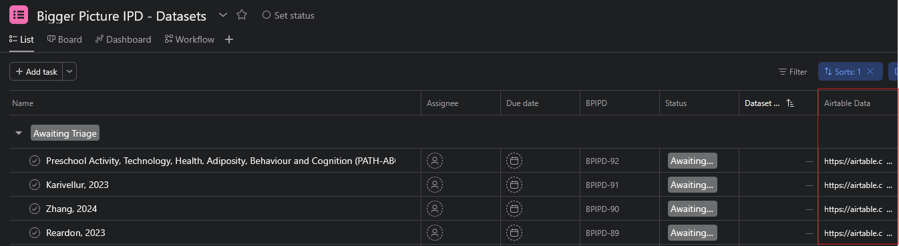

# Validating Extracted Data

???+ note
    This is a somewhat convoluted process at the moment.
    We are working on improving it, and feedback is valuable.
    If you find a way something can be done better, don't keep it to yourself!

## Overview of Steps

The processing of validating extracted data is a multi-step process.
As a quick overview, the steps are:

1. Pick a dataset to validate.
2. Check the details of the article attached to the dataset.
   In particular, you need to check:
      1. The population details
      2. The screen time measure details
      3. The outcomes details (including adding a 'validated' outcome to each outcome)
3. Check the overall dataset details, including confirming that the dataset is not a duplicate.
4. Mark the dataset as 'validated' in Asana.

## Checking the Extracted Data

### Choosing a Dataset to Validate

Start by picking a dataset from the 'Awaiting Triage' set in [Asana][asana].
Even though this is also shown in Airtable, we use Asana as the 'source of truth' for the stage that a dataset is at.
Any dataset that is in the 'Awaiting Triage' set in Asana is ready to be validated.

{ width=80% }

In the 'Airtable Data' column, there is a link to the Airtable record for the dataset (highlighted in red above).
Clicking the link is the easiest way to open the Airtable record for the dataset.

### Checking the Data

There are two main ways to check the data: using the 'form' view, or using the filters.
Either is fine, but for generally checking the data I find the 'form' view easier to use.

#### Open the forms

- ##### 1. Open the dataset form

    ---

    If you haven't followed the link from Asana, you can open the form view by clicking the two-arrow icon that appears when you hover over a record.

    

- ##### 2. Open the article form

    ---

    Airtable will 'stack' forms on top of each other, which makes it quite convenient to work down through the layers of data.
    Before you can validate the dataset fields, you need to check the article.
    Clicking on the linked article (under 'Articles: IDs') will open the form for the article.

    

- ##### 3. Download the full text

    ---

    You'll likely want to download the full text (or open it in a new tab) so that you can view it while validating the data.

    

#### Check the article form

- ##### 1. Check the fields on the article form

    ---

    Check the fields on the article form, such as the author details, the year of data collection, the study design, countries of data, and the total sample size.

- ##### 2. Open the hidden fields

    ---

    

The next steps are to work through each of the populations, screen time measures, and outcomes in the article.

#### Check the population form(s)

- ##### 1. Open the population form(s)

    ---

    

- ##### 2. Check the population fields

    ---

    In particular, check the sample size and proportion of girls.
    Remember that you can [add][addrecord] or [remove][removerecord] populations as needed.
    Each one needs it's own record.

    ???+ tip
        Most studies will only have one population.
        Examples where you might need to have multiple populations are:

        - Studies that have split their sample by age group or gender and **not reported an 'overall' sample**.
            In this case, use a population for each group.
        - Cohort studies where there are two distinct cohorts.
            Again, if they report one overall description which covers all the participants than you can just use one population form.

- ##### 3. When you are done, close the population form

    ---

    

If there are multiple populations, repeat for each one.

#### Check the screen time measure(s)

- ##### 1. Open the screen time measure(s)

    ---

    

- ##### 2. Check the screen time measure fields

    ---

    Remember that you can [add][addrecord] or [remove][removerecord] screen time measures if the AI has made a mistake.

    ???+ tip
        The AI tends to be quite literal when extracting here.
        For example, it might extract 'interacting on social media' because that is the term used in the article, rather than something simpler like 'social media'.
        This doesn't matter too much because we will combine these later.
        But, it can be helpful to add a simpler screen time term (like 'social media').
        Don't feel you need to spend time trying to fix the AI's extraction, though, just add an additional term if you think it will be useful.

- ##### 3. When finished, click the close button

    ---

    

If there are multiple screen time measures, repeat for each one.

#### Check the outcome form(s)

- ##### 1. Open the outcome(s)

    ---

    

- ##### 2. Check the outcome fields and add the validated outcome

    ---

    Start by checking the already extracted outcome fields are correct.

    ???+ tip
        You do not need to edit the **Outcome** field.
        Use this to guide you in selecting the correct validated outcome, but because of the way the AI extraction works, it is too time-consuming to fix this field.
        You should update the **Outcome Group** and the **Outcome Measure** fields, however.

- ##### 3. For each outcome add a 'validated' outcome

    ---

    You can read the full instructions for [adding a validated outcome][addvalidated] in the next section.
    Briefly, the steps are:

    1. Click the 'Add option' button.
       
    2. Search for an existing matching outcome.
       If you fine one, select it and you are done.
    3. If there isn't an existing one, add a new one and complete the required fields.

- ##### 4. When finished, click the close button

If there are multiple outcomes, repeat for each one.
Remember that you can [add][addrecord] or [remove][removerecord] outcomes if the AI has made a mistake.

#### Check the dataset form

Once all of the data for the article has been checked, you can check the dataset fields.

- ##### 1. Check the sample size

    ---

    If you changed the sample size you should also update it in the dataset form.

    

- ##### 2. Check the contact name

    ---

    Check that the dataset contact name is a correctly formatted name.
    That is, remove any titles (e.g., Dr., Prof.), initials (e.g., J. Doe) and ensure it is in 'First Last' format.

    

- ##### 3. Check the contact email

    ---

    Check the email field matches the corresponding author email.
    If the article is quite old, a quick Google search may help to find a current email address.

    

- ##### 4. Check the potential duplicates

    ---

    Check the 'Potential Duplicates' field to see if there are any potential duplicates.
    If there are, follow the [deduplication instructions][dedupe] to resolve them.

    

- ##### 5. Check if this is a national or government dataset

    ---

    If the dataset is a national dataset, or one that is run by a government, the recruitment process may be different.
    Use the checkbox to indicate if this is the case.

    

### Updating the record in Asana

#### Checklist

When you are satisfied that the data in Airtable is correct, you can update the record in [Asana][asana] to indicate that the dataset has been validated.
Before doing this, check that you have:

- [x] Checked the dataset and article details are correct
- [x] [Removed any incorrect populations, screen time measures, or outcomes][removerecord]
- [x] [Added any additional populations, screen time measures, or outcomes][addrecord] that were not extracted by the AI
- [x] [Checked that the dataset is not a duplicate][dedupe]
- [x] Check the name and email of the corresponding author

#### Update the Asana task

???+ tip
    Make sure you use the 'Dataset ID' (e.g., `BPIPD-01`) to find the dataset in Asana.
    Don't rely on the name - it may not be unique!

- ##### 1. Find the dataset in Asana

    ---

    

- ##### 2. Click on Awaiting Triage

    ---

    

- ##### 3. Click on Validated

    ---

    

    ???+ tip
        If the dataset is from some countries (e.g., China, Russia), we are unlikely to be able to access it due to Australia's Foreign Interference laws.
        In this case, you can skip 'Validated' and instead mark the dataset as 'Non-priority'.

That's it!
You have successfully validated a dataset.

[asana]: https://app.asana.com/1/653672074038961/project/1210433819516828/list/1210434509883894
[addrecord]: extraction_addremove.md/#adding-an-additional-populationscreen-time-measureoutcome
[removerecord]: extraction_addremove.md/#removing-incorrect-populationsscreen-time-measuresoutcomes
[addvalidated]: extraction_addvalidated.md/#adding-a-new-validated-outcome
[dedupe]: extraction_dedupe.md/#deduplicating-datasets
