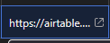
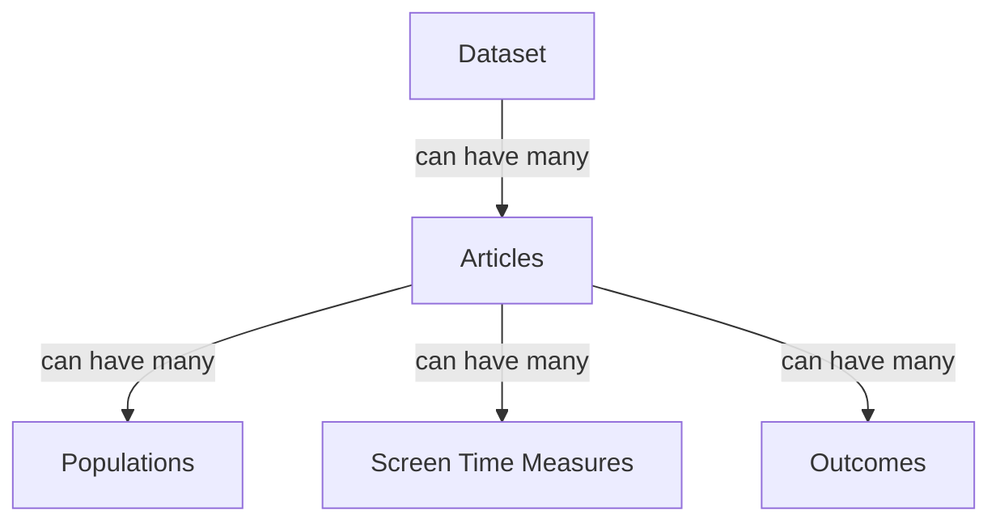

# Validating Extracted Data

???+ note
    This is a somewhat convoluted process at the moment.
    We are working on improving it, and feedback is valuable.
    If you find a way something can be done better, don't keep it to yourself!

## Checking the Extracted Data

Start by picking a dataset from the 'Needs Validation' set in Asana.
Even though this is also shown in Airtable, we use Asana as the 'source of truth' for the stage that a dataset is at.
In the 'Airtable Data' column, there is a link to the Airtable record for the dataset.

Clicking the link is the easiest way to open the Airtable record for the dataset.

