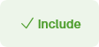
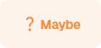

# Screening Process

We are only screening articles once, rather than screening in duplicate as is common in systematic reviews.
We may later go back and double-screen articles that were excluded to ensure we haven't missed anything, but our priority is to get through the screening process as quickly as possible so that we can start contacting authors.
When screening in Rayyan, it is important to set the filters so that you are only seeing articles that have not been screened yet, as this is not the default.

## Title and Abstract Screening

The goal of the title and abstract stage is just to remove articles that are clearly irrelevant to the Bigger Picture project.
We aim to do this bit as quickly as possible - don't labour over decisions at this stage.
If you are on the fence about an article, it is best to include it and review it in the full text stage.

### Setup Rayyan for Title and Abstract Screening

1. Log in to [Rayyan](https://www.rayyan.ai/) and navigate to the [Bigger Picture Project](https://new.rayyan.ai/reviews/1388927/overview).
2. Click on the **Screening** tab.
3. Set the filters to show only articles that need to be screened:
      - The filter by inclusion at the top of the list of articles should be set to 'Undecided':

        

      - The 'Max member Decisions' filter should be set to 'At most 0' (that is, articles that have not been screened by anyone yet):

        

You are welcome to use the other filters to speed up the process.
Some useful filters are:

- *Keywords for Include/Exclude*: These are words that we have identified as common in either articles that are usually included or excluded.

### Screening Title and Abstracts

Use the  or  buttons to screen articles.
Avoid using the  button, as this just requires it to be screened again later.

The fastest way to screen articles is to use the keyboard shortcuts in Rayyan.
Use the ++i++ key to include an article, the ++e++ key to exclude it.

???+ tip
    You can quickly view the keyboard shortcuts in Rayyan by pressing the ++v++ key.

## Full Text Screening

### Setup Rayyan for Full Text Screening

Setting up Rayyan is the same as for [Title and Abstract Screening](#setup-rayyan-for-title-and-abstract-screening).
Navigate to the **Full Text Screening** tab and apply the same filters as above.
You may also want to filter by if an article already has a PDF attached by setting the 'Full Text' filter to 'Private' (:person_shrugging:).

### Screening Full Texts

There are two main differences between the full text screening and the title and abstract screening:

1. When you **exclude** an article, you need to provide a reason.
   You do this using the 'Exclude with Reasons' box at the bottom of the screen.

    ???+ tip
        You can quickly access the exclusion reasons by pressing the ++r++ key.

2. When you **include** an article, you need to add a label that tells our software that it is ready to be extracted. (1)
   When you have included an article, please add the label `Included: Not Yet Extracted` to the article.
   Note that this label is case-sensitive, so you need to type it exactly as shown (or better yet, copy and paste it).
   You can add a label by clicking in the labels box at the bottom of the screen.
   If you have already added the label to another article, it should appear in the list of options.

    ???+ warning
        A common issue is that clicking 'Include' automatically moves you to the next article.
        That means that if you then add the label, it will not be applied to the article you just included.
        To avoid this, add the label first, then click 'Include'.
        Adding the label doesn't change the article that you are currently viewing.

1. For some inexplicable reason, the Rayyan API does not differentiate between articles included at the title and abstract stage and those included at the full text stage.
   So, we have to use a label to indicate that an article is ready for extraction.

## Other Useful Information

### Rayyan Ratings

Rayyan provides a function that rates how likely an article is the be relevant to the review.
This can be useful for deciding which articles to screen first (those likely to be relevant, or most likely to be irrelevant).
The method for using rating is described in the [Rayyan documentation](https://help.rayyan.ai/hc/en-us/articles/17461088734353-How-to-use-Rayyan-s-Predictions-Classifier-for-Relevance-Ranking).
It only works at the title and abstract stage.

### Potentially Relevant Systematic Reviews

If you find a systematic review that is potentially relevant (i.e., it looks like it might have studies in it that could be included), please add the `Potentially Relevant Systematic Review` label to the article.
Eventually, we will go through these and check if we have missed any articles that should be included.
